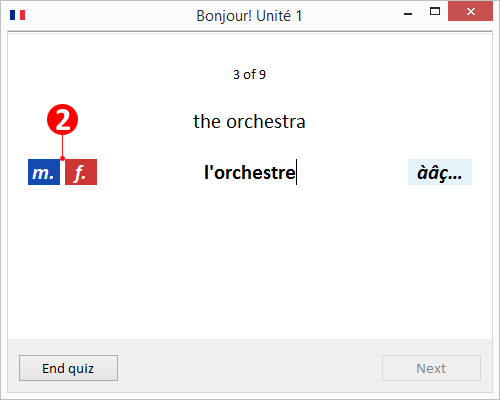

# VocabularyFox

VocabularyFox is an open-source vocabulary quiz program, written in Java.

VocabularyFox:
* Supports (but is not limited to) English and French vocabulary quizzes
* Lets you add your own vocabulary quizzes easily
* Includes a sample vocabulary quiz
* Lets you choose the language of the user interface (currently English and German).  
**NOTE**: _If you like to contribute to adding another language, feel free to contact me at_ "lo (dot) wiest (at) web (dot) de".

I developed VocabularyFox on Windows 8.1 (64-bit), but it should be easy to port it to other platforms.

The VocabularyFox source code is available under the MIT license.

Enjoy -- Lorenz

## Table of Contents

* [Quick Start](#quick-start)
* [Visual Tour](#visual-tour)
* [How to Add Your Own Quizzes](#how-to-add-your-own-quizzes)
* [Technical Footnotes](#technical-footnotes)
* [Build Instructions](#build-instructions)
* [Porting Tips](#porting-tips)

## Quick Start

I have prepared for you a ready-to-run VocabularyFox file for the Windows (64-bit) platform. To run it, follow these steps:

1. Download and extract this project's ZIP file from GitHub.
2. Open folder `exe`. 
3. Double-click the file `VocabularyFox.exe`.

## Visual Tour

### Selecting a Quiz

Select a vocabulary quiz from the list:

To select quiz options, click the gear icon . This opens the Preferences dialog. It displays the version number, lets you change the language of the user interface (currently English and German), and lets you modify quiz options:

### Taking a Quiz

This is a sample of a French quiz:

**TIP**: To make typing easier when entering an answer, you can use a set of abbreviations (depending on the language). The screenshots below show the supported abbreviations for English and French quizzes:

 

_(French quizzes only)_ To enter French text with a non-French keyboard, click button (1). This opens a list of French characters. Select one of the characters to insert it into your answer.

_(French quizzes only)_ Buttons (2) appear with nouns whose article doesn't indicate the gender. After typing the answer, click either the "m." (masculine) of "f." (feminine) button to define the gender, then continue with the next word.

### Reviewing the Quiz Results

After you have entered all answers, your results are listed:

Your answers are are color-coded as follows: 
* Black: Correct answer on your first try
* Orange: Correct answer on your second try
* Red: Correct answer on your third try - or no correct answer at all
* Blue: Noun of masculine gender
* Dark red: Noun of feminine gender

To save your results as a web page to the file system, click on the download page icon .

If you'd like to repeat a quiz, you can repeat either the entire quiz or just the words with wrong answers:

## How to Add Your Own Quizzes

It is easy to add your own quizzes to VocabularyFox!
* See [instructions in English](doc/VocabularyFox.Instructions.English.pdf).
* See [instructions in German](doc/VocabularyFox.Instructions.German.pdf).

## Technical Footnotes

* The `VocabularyFox.exe` file contains the VocabularyFox Java classes and startup code for Windows. The startup code looks for a Java Runtime installed on your system. If it doesn't find one, it uses the OpenJDK Java Runtime bundled with VocabularyFox. It is located in the `openJdk` folder of this project's ZIP file. If a Java Runtime is installed on your system, you can simply delete the `openJdk` folder. The file `VocabularyFox.exe` was created with Launch4J. Both Launch4J and OpenJDK are open-source software.
* VocabularyFox looks for quizzes in the `quizzes` folder, which is located in the same folder as the `VocabularyFolder.exe` file. If no `quizzes` folder exists, then VocabularyFox creates a `quizzes` folder with a sample quiz.
* VocabularyFox saves and loads application preferences from the `.preferences_vocabularyfox` file, which is located in the same folder as the `VocabularyFolder.exe` file. If VocabularyFox doesn't find this file, it is automatically created by VocabularyFox.

## Build Instructions

**Prerequisites:**
* You are running a Windows (64-bit) system.
* You have a Java SDK installed on your system (I used Java SDK 8 (64-bit)).
* You have an Eclipse IDE installed on your system (I used Eclipse 4.5.0 "Mars" (64-bit)).

1. Download the ZIP file of this project from GitHub.
2. Unzip it to a temporary folder ("temp folder").
3. Import the `VocabularyFox` project from the temp folder to your Eclipse IDE as an import source _General > Existing Projects into Workspace_.
4. In the _Project Explorer_ view, right-click _VocabularyFox_ and select _Run As > Java Application_.
5. The VocabularyFox application starts. Close it.
6. In the _Project Explorer_ view, right-click _VocabularyFox_ and select _Export..._.
7. Select _Java > Runnable JAR file_.
8. Click _Next >_.
9. Under _Launch Configuration_, select _VocabularyFox - VocabularyFox_.
10. Under _Export destination_, enter the full pathname of the exported application, for example `C:\TEMP\VocabularyFox.jar`.
11. Select the radio button _Package required libraries into generated JAR_.
12. Click _Finish_.
13. Use a file explorer to find the exported JAR file.
14. To run the exported JAR file, double-click it.
15. To convert the JAR file into an executable file see the Launch4J project on the Internet.

## Porting Tips

To port VocabularyFox to another platform, apply the following changes:

1. Adjust the font name set to `Resources.FONT_NAME` (currently `"Calibri"`) to a font available on your platform.
2. Replace the SWT library `org.eclipse.swt.win32.win32.x86_64_XXX.jar` with the SWT library specific to your platform (Tip: The library name follows the pattern `org.eclipse.swt.<platform>_<version>.v<timestamp>.jar`.).
