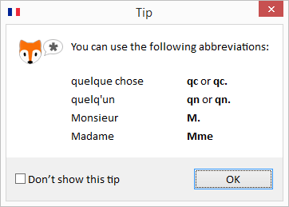
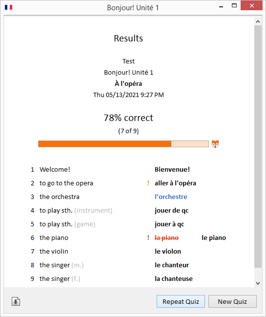

# VocabularyFox

VocabularyFox is an open-source word quiz program, written in Java.

VocabularyFox
* Supports (but is not limited to) English and French word quizzes
* Lets you add your own word quizzes easily
* Includes a sample word quiz
* Lets you choose the language of the user interface (currently English and German. If you like to contribute to adding another language, feel free to contact me at "lo (dot) wiest (at) web (dot) de").

I developed VocabularyFox on Windows 8.1 (64-bit), but it should be easy to port it to other platforms.

The VocabularyFox source code is available under the MIT license.

Enjoy -- Lorenz

## Table of Contents

* [Quick Start](#quick-start)
* [Visual Tour](#visual-tour)
* [How to Add Your Own Quizzes](#how-to-add-your-own-quizzes)

## Quick Start

I have prepared for you a ready-to-run VocabularyFox file for the Windows (64-bit) platform. To run it, follow these steps:

1. Download and extract this project's ZIP file from GitHub.
2. Extract the file `VocabularyFoxReadyToRun.zip`.
3. Double-click the file `VocabularyFox.exe`.

**INFO**: The file `VocabularyFox.exe` contains the VocabularyFox Java classes and startup code for Windows. The startup code looks for a Java Runtime installed on your system. If it doesn’t find one, then it uses the OpenJDK Java Runtime in the extracted `jre` folder. If a Java Runtime is installed on your system, you can delete the `jre` folder.

The file `VocabularyFox.exe` was created with Launch4J.

Both Launch4J and OpenJDK are open-source software.

## Visual Tour

### Selecting a Quiz

Select a quiz from the list. Use the input field to find a quiz if the list is long.

**INFO**: VocabularyFox quizzes are located in the `quizzes` folder. If no such folder exists, then VocabularyFox creates a `quizzes` folder with a sample quiz.

To select quiz options, click the cogwheel icon . This opens the preferences dialog. It displays the version number, lets you change the language of the user interface (currently English and German), and lets you modify quiz options:

### Taking a Quiz

A tip upfront: To make typing easier when entering an answer, you can use a set of abbreviations (depending on the language). The following screenshots show the supported abbreviations for English and French quizzes:

 

This is a sample of a French quiz:

_(French quizzes only)_ To enter French text with a non-French keyboard, click this button (1). This opens a list of French characters. Select one of the characters to insert it into you answer.

_(French quizzes only)_ These buttons (2) appear with French nouns whose article doesn’t indicate the gender. After typing the answer, click either the "m." (masculine) of "f." (feminine) button to continue with the next question.

### Getting the Results of a Quiz

After entering all answers your results are listed:

In the results, wrong answers are displayed with strikethrough characters. If you entered the correct answer on your second try, your answer is displayed in orange color. If you needed more tries, your answer is displayed in red color. Blue and dark red answers indicate the gender of the word, masculine and feminine, respectively.

To save your results as a web page to the file system, click on the download page icon .

If you want to repeat a quiz, you can repeat either the entire quiz or just the words with wrong answers:

## How to Add Your Own Quizzes

It is easy to add your own quizzes to VocabularyFox!
* See <file> for instructions in English.
* See <file> for instructions in German.
