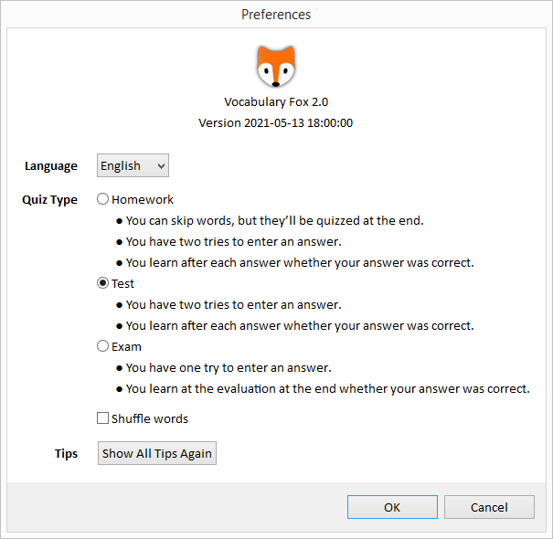
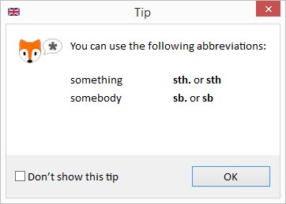
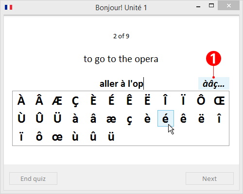

# VocabularyFox

VocabularyFox is an open-source vocabulary quiz program, written in Java.

VocabularyFox offers the following:
* Supports (but is not limited to) English and French vocabulary quizzes
* Lets you add your own vocabulary quizzes easily
* Includes a sample vocabulary quiz
* Lets you choose the language of the user interface (currently English and German).  
* >[!NOTE]
  > If you like to contribute to adding another language, feel free to contact me at "lo (dot) wiest (at) web (dot) de".

I developed VocabularyFox on Windows 8.1 (64-bit), but it should be easy to port it to other platforms.

Enjoy &mdash; Lorenz

## Table of Contents

* [Quick Start](#quick-start)
* [Visual Tour](#visual-tour)
* [How to Add Your Own Quizzes](#how-to-add-your-own-quizzes)
* [Technical Footnotes](#technical-footnotes)
* [Build Instructions](#build-instructions)
* [Porting Tips](#porting-tips)
* [License](#license)


## Quick Start

### Prerequisites
* You have installed Java JDK 8 or Java SDK 8 or higher on your system.

### Instructions
1. Download [VocabularyFox.jar](https://github.com/lwiest/VocabularyFox/releases/download/v2.0/VocabularyFox.jar) to a folder.
2. Open a command prompt in that folder and enter
   ``` 
   java -jar VocabularyFox.jar
   ```

## Visual Tour

### Selecting a Quiz

Select a vocabulary quiz from the list:


### Selecting Quiz Options

To select quiz options, click the gear icon . This opens the _Preferences_ dialog. It displays the version number, lets you change the language of the user interface (currently English and German), and lets you modify quiz options:



### Taking a Quiz

This is a sample of a French quiz:


> [!TIP]
> To make typing easier when entering an answer, you can use a set of abbreviations (depending on the language). The screenshots below show the supported abbreviations for English and French quizzes:

 

_(French quizzes only)_ To enter French text with a non-French keyboard, click button (1). This opens a list of French letters. Select one of the letters to insert it into your answer.



_(French quizzes only)_ Buttons (2) appear with nouns whose article doesn't indicate the gender. After typing the answer, click either the _m._ (masculine) or _f._ (feminine) button to define the gender, then continue with the next word.


### Reviewing the Quiz Results

After you have entered all answers, your results are listed:


Your answers are are color-coded as follows: 
* Black  : Correct answer on your first try
* Orange  exclamation mark: Correct answer on your second try
* Red  exclamation mark: Correct answer on your third try &mdash; or no correct answer at all
* Blue  : Noun of masculine gender
* Dark red  : Noun of feminine gender

### Saving Quiz Results

To save your results as a web page to the file system, click on the download page icon .

### Repeating a Quiz

If you like to repeat a quiz, you can repeat either the entire quiz or just the words with wrong answers:


## How to Add Your Own Quizzes

It is easy to add your own quizzes to VocabularyFox!
* See [instructions in English](doc/VocabularyFox.Instructions.English.pdf).
* See [instructions in German](doc/VocabularyFox.Instructions.German.pdf).

## Technical Footnotes

* VocabularyFox looks for quizzes in the `quizzes` folder, located in the same folder as the `VocabularyFox.jar` file. If VocabularyFox doesn't find this folder, then VocabularyFox automatically creates at this location a `quizzes` folder with a sample quiz.
* VocabularyFox saves and loads application preferences from the `.preferences_vocabularyfox` file, which is located in the same folder as the `VocabularyFox.jar` file. If VocabularyFox doesn't find this file, then VocabularyFox automatically creates it at this location.

## Build Instructions

### Prerequisites

* You are running a Windows (64-bit) system.
* You have installed Java SDK 8 (or higher) (64-bit) on your system (I used Java SDK 8 (64-bit)).
* You have installed an Eclipse IDE on your system (I used Eclipse 4.5.0 "Mars" (64-bit)).

### Instructions

1. Download the [project ZIP file](https://github.com/lwiest/VocabularyFox/archive/master.zip) from GitHub.
2. Unzip it to a temporary folder.
3. **To work with the VocabularyFox source code in your Eclipse IDE**, import the `VocabularyFox` project from the temporary folder to your Eclipse IDE as an import source _General > Existing Projects into Workspace_.
4. In the _Project Explorer_ view, right-click _VocabularyFox_ and select _Run As > Java Application_.
5. The VocabularyFox application starts.

## Porting Tips

To port VocabularyFox to another platform, apply the following changes:

1. Adjust the font name assigned to variable `Resources.FONT_NAME` (currently `"Calibri"`) to a font available on your platform.
2. Replace the SWT library `org.eclipse.swt.win32.win32.x86_64_XXX.jar` with the SWT library specific to your platform 
>[!TIP]
> The library name follows the pattern `org.eclipse.swt.<platform>_<version>.v<timestamp>.jar`.

## License

This project is available under the MIT license.
